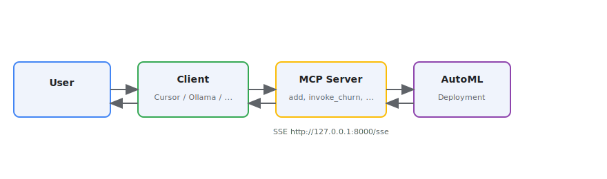

<!-- Assisted-by: Cursor -->
# MCP AutoML Server

An MCP (Model Context Protocol) server that exposes **config-driven tools** backed by JSON schemas. Tools are defined in a YAML file; each tool gets its input shape from a JSON Schema and can optionally call an HTTP deployment (e.g. AutoML) with the validated payload.

Use it with LangChain/LangGraph and an LLM to turn natural language into structured tool calls and deployment invocations (e.g. churn prediction). You can also attach this MCP server to **Cursor** or **Ollama** (see [Attaching to Cursor and Ollama](#attaching-to-cursor-and-ollama)).

## How to use the MCP server

1. **Start the MCP server** (e.g. `python mcp_automl/mcp_server.py`). It exposes tools over SSE at `http://127.0.0.1:8000/sse`.
2. **Connect a client** — Cursor, the demo script (`interact_with_mcp.py`), or an Ollama MCP client — to that URL.
3. **Ask questions or run actions**; the client sends your request to the LLM, which can call the server’s tools (e.g. `add`, `invoke_churn`). If a tool is configured with a deployment, the server calls your AutoML deployment and returns the result.

**Diagram:** The flow is shown below.



## Why use the MCP server?

Using the **MCP server and tools** is better when you want to:

- **Use natural language** — Ask in plain language (“Will this customer churn? They have 12 months tenure, Month-to-month contract, $70 monthly charges.”). The client’s LLM turns that into a structured tool call; you don’t hand-craft JSON or manage field names and enums yourself.
- **Integrate with AI assistants** — Cursor, Ollama clients, and other MCP-aware tools discover and call your deployment as a **tool**. The model chooses when to call it and how to interpret the result, so you get a conversational flow instead of writing one-off scripts.
- **Reuse one endpoint across clients** — One MCP server URL works from Cursor, the demo script, LangGraph agents, and any MCP client. Raw requests mean separate integration code per environment.
- **Enforce and validate input** — The server turns your JSON Schema into a tool contract: required vs optional fields, enums, and types. Invalid or missing inputs are caught before the deployment is called; with raw requests you must validate and format the body yourself.
- **Keep credentials and URL in one place** — The server reads `DEPLOYMENT_URL` and `DEPLOYMENT_TOKEN` from the environment. Clients only need the MCP server URL; they never see or store deployment credentials.

For quick tests or custom pipelines, raw requests are fine (see the notebook). For chat-based or multi-client use, the MCP server is the better fit.

## Features

- **Schema-driven tools**: Define tools by name, description, and path to a JSON Schema; the server builds Pydantic models and flat tool parameters from the schema.
- **Required vs optional**: The JSON Schema `required` array controls which parameters are required; omitted optional parameters are set to `None`.
- **Deployment integration**: Optionally POST validated input to an HTTP endpoint (e.g. AutoML deployment) using env-based URL and Bearer token.
- **SSE transport**: Server runs over SSE for use with MCP clients (e.g. `interact_with_mcp.py` with LangGraph).

## Directory structure

```
mcp_automl_template/
├── pyproject.toml      # Project metadata and dependencies
├── mcp_server.py       # FastMCP server; registers example tools + tools from YAML
├── register_tools.py   # Loads tools_config.yaml, builds tools from JSON schemas
├── tools_config.yaml   # Tool definitions: name, description, schema_path, deployment env vars
├── churn_schema.json   # JSON Schema for churn prediction tool input
├── utils.py            # json_schema_to_pydantic_model, LLM clients (OpenAI/Ollama, Llama Stack)
├── interact_with_mcp.py # Client: connects via SSE, loads MCP tools, runs LangGraph agent
└── README.md
```

## Prerequisites

- Python 3.10+
- For deployment tools: an HTTP endpoint (e.g. AutoML deployment) and its URL + Bearer token
- For the demo client: an LLM (Ollama, OpenAI, or Llama Stack)

## Setup

1. **Install dependencies**

   With [uv](https://docs.astral.sh/uv/):
   ```bash
   uv pip install .
   ```

2. **Environment**

   Copy `template.env` from the parent folder to `.env` and set real values for every variable:

   ```bash
   mv ../template.env .env
   ```

   Your `.env` file must include **all** variables defined in `template.env`:

   - `DEPLOYMENT_URL` – prediction endpoint URL (e.g. AutoML deployment)
   - `DEPLOYMENT_TOKEN` – Bearer token for that endpoint
   - `LLAMA_STACK_CLIENT_BASE_URL` – Llama Stack base URL (for `interact_with_mcp.py`)
   - `LLAMA_STACK_CLIENT_API_KEY` – Llama Stack API key

   Replace the placeholders with your actual values. For local LLM testing with Ollama only, the deployment and Llama Stack vars can stay as placeholders if you do not use those features.

## Configuration

### Tools: `tools_config.yaml`

Each entry under `tools` defines one MCP tool:

| Key | Required | Description |
|-----|----------|-------------|
| `name` | Yes | MCP tool name (e.g. `invoke_churn`) |
| `description` | Yes | Description for the LLM |
| `schema_path` | Yes | Path to JSON Schema file (relative to the config file) |
| `deployment_url_env` | No | Env var name for the deployment URL |
| `deployment_token_env` | No | Env var name for the Bearer token |

If both deployment env vars are set, the tool will POST the validated input (as `instances`) to that URL with the given token. Otherwise the tool returns the validated payload as a dict.

Example:

```yaml
tools:
  - name: invoke_churn
    description: Invoke deployment for Telco customer churn prediction.
    schema_path: churn_schema.json
    deployment_url_env: DEPLOYMENT_URL
    deployment_token_env: DEPLOYMENT_TOKEN
```

### Input schema: `churn_schema.json`

Standard JSON Schema with `properties` and `required`. Field types and `required` are respected: required parameters have no default; optional ones default to `None` when not provided. The server also coerces the string `"null"` to `None` for optional fields.

## Deploying to OpenShift

The MCP AutoML server deploys to OpenShift using the shared Helm chart. From the parent `mcp_agent/` directory:

### Prerequisites

- `oc` CLI installed and logged in to your OpenShift cluster
- [Helm 3](https://helm.sh/docs/intro/install/) installed
- `DEPLOYMENT_URL` and `DEPLOYMENT_TOKEN` set in `.env` (see `.env.example`)

### Deploy

```bash
cd agents/autogen/mcp_agent
make deploy-mcp
```

This builds the container image in-cluster via OpenShift BuildConfig and deploys using `helm upgrade --install`. The Route URL is printed on success.

### Preview rendered manifests

```bash
make dry-run-mcp
```

### Remove

```bash
make undeploy-mcp
```

## Running the MCP server

From the project root (or the directory containing `mcp_server.py`):

```bash
python mcp_automl_template/mcp_server.py
```

This starts the FastMCP server (e.g. SSE on `http://127.0.0.1:8000/sse`). Built-in tools (`add`, `sub`) and all tools from `tools_config.yaml` are registered.

## Testing with the demo client

With the MCP server running, in another terminal:

```bash
python mcp_automl_template/interact_with_mcp.py
```

This connects to the server via SSE, loads MCP tools, and runs a LangGraph ReAct agent with the configured LLM. You can type questions or use predefined prompts. The agent will call tools (e.g. `invoke_churn`) when appropriate.

## Attaching to Cursor and Ollama

The server exposes MCP over **SSE** at `http://127.0.0.1:8000/sse` (or `http://localhost:8000/sse`). You must **start the server first**, then attach it from Cursor or an Ollama-capable client.

**Start the server** (from repo root or from this directory):

```bash
python mcp_automl/mcp_server.py
```

Keep this process running while using Cursor or Ollama.

### Cursor

1. **Start the MCP server** (see above).
2. **Add the server in Cursor:**
   - **UI:** **Settings** (`Cmd + ,` / `Ctrl + ,`) → **Tools & MCP** → **Add new MCP server** → choose **streamable HTTP** (SSE) and set **URL** to `http://127.0.0.1:8000/sse` (name e.g. `automl`).
   - **Config file:** Create or edit `.cursor/mcp.json` in your project (or `~/.cursor/mcp.json` for all projects):

   ```json
   {
     "mcpServers": {
       "automl-churn": {
         "url": "http://127.0.0.1:8000/sse"
       }
     }
   }
   ```

3. Restart Cursor or reload MCP servers. The tools (`add`, `sub`, `invoke_churn`, etc.) will appear for the AI.

**Note:** Cursor must be able to reach the server; leave the terminal with `mcp_server.py` running (or run it in the background).

### Ollama

Ollama’s CLI does not run MCP clients. To use this MCP server with Ollama you need an app or client that supports both Ollama and MCP:

- **Ollamac** (macOS): In MCP settings, add a **remote** server with URL `http://127.0.0.1:8000/sse` (with this MCP server already running). Use a tool-capable model (e.g. Llama 3.1+, Mistral).
- **Other MCP clients:** Any client that supports SSE can use `http://127.0.0.1:8000/sse` once this server is running.

**Alternative:** Use the included demo client: run `interact_with_mcp.py`. It uses `get_chat_from_env()` (same `BASE_URL` / `MODEL_ID` / `API_KEY` as the main agent). For local Ollama, set those in `.env` (see root `template.env` example). The agent will call this MCP server’s tools using that LLM.

## Adding a new tool

1. Add a JSON Schema file (e.g. `other_schema.json`) with `properties` and optional `required`.
2. In `tools_config.yaml`, add an entry with `name`, `description`, `schema_path`, and optionally `deployment_url_env` and `deployment_token_env`.
3. Restart the MCP server.

No code changes are required; tools are created from the YAML and schema at startup.

## AutoML experiment and deployment

For a full walkthrough of creating an AutoML experiment on Red Hat OpenShift AI, deploying the best model, and using it with this MCP server, see **[AUTOML_DEPLOYMENT.md](AUTOML_DEPLOYMENT.md)**. It is based on the [Red Hat AI examples – Predict Customer Churn tutorial](https://github.com/red-hat-data-services/red-hat-ai-examples/blob/automl_sample/examples/automl/churn_prediction_tutorial.md) and covers:

1. Creating a project, S3 connections, Pipeline Server, and workbench.
2. Running the AutoML pipeline and viewing the leaderboard.
3. Registering the model, preparing the AutoGluon ServingRuntime (KServe), and deploying the model.
4. Setting `DEPLOYMENT_URL` and `DEPLOYMENT_TOKEN` in `.env` and using the deployment with the MCP server.

## License

See [LICENSE](LICENSE).
