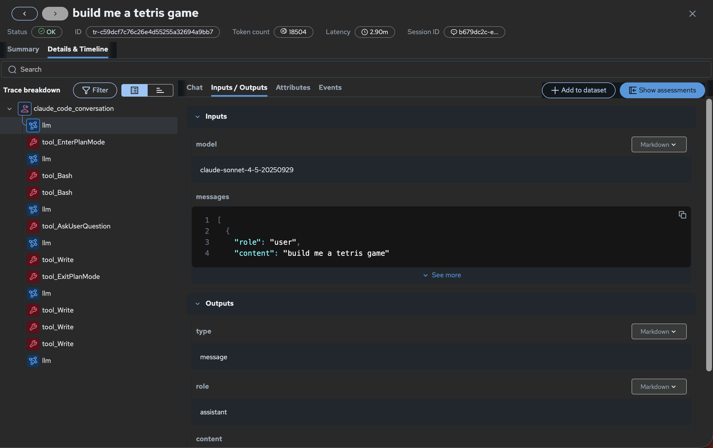
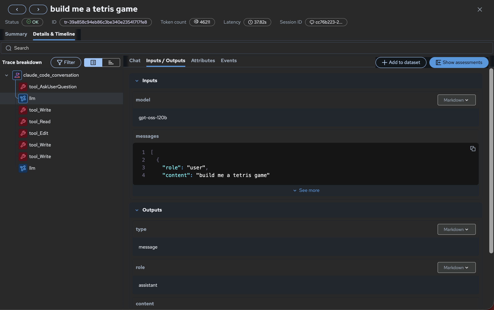
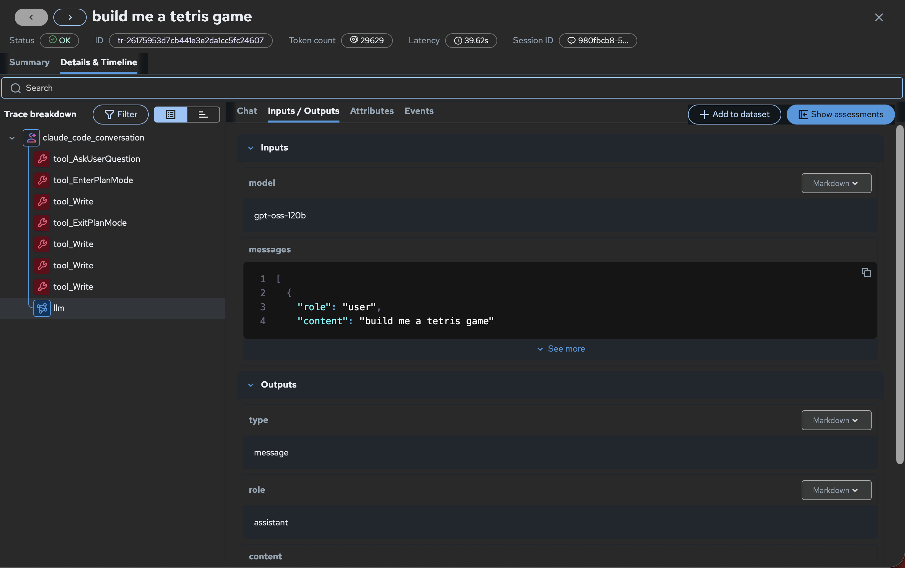
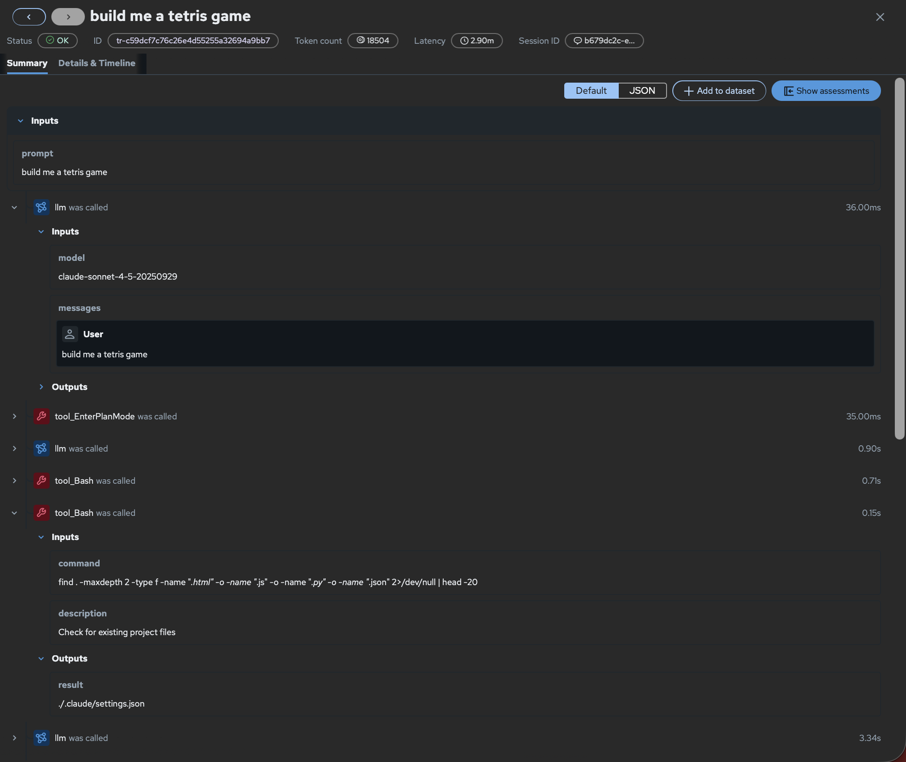
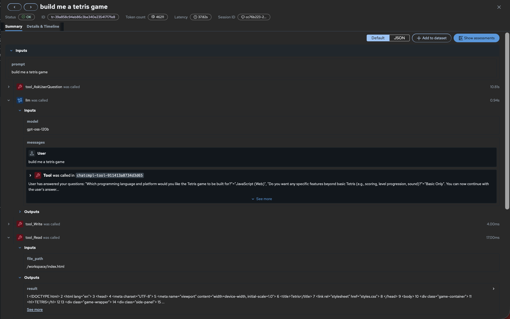
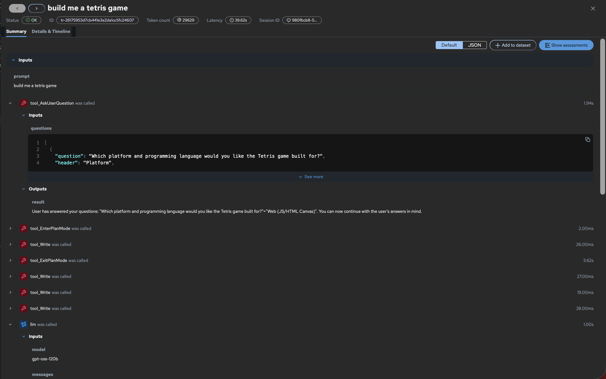

# MLflow Tracing for Claude Code Agent Runtimes on RHOAI

We deployed Claude Code as a containerized agent on Red Hat OpenShift AI and wired it up to the MLflow instance running on the same cluster. To validate the full tracing stack, we ran the same prompt — **"build me a tetris game"** — through three different backends: Vertex AI (Google Cloud), vLLM directly, and OGX routing to vLLM. In all three cases, MLflow captured the complete session trace including every tool call, token usage, latency, and the full execution waterfall. The sections below document the telemetry investigation, the tracing prototype, session-level metrics, and the setup guide for productizing this on RHOAI 3.5.

---

## RHAIENG-4751 — Inventory OGX Telemetry Hooks and MLflow Integration Points

### Summary

Agent-level instrumentation via `mlflow autolog claude` works out of the box with any backend. Swapping Vertex AI for vLLM or OGX produces the same trace schema with no changes to the tracing setup. If server-side OGX OTel spans are needed in future, they would be added to the Claude Code stop hook.

### OGX Telemetry Capabilities

OGX 1.0.2 emits structured logs per request:

```text
INFO  Using native /v1/messages passthrough
      base_url=http://vllm-120b-predictor.gpt-oss.svc.cluster.local
      model=vllm/gpt-oss-120b
      HTTP 200
```

| Signal | Available |
|---|---|
| Model name | ✅ |
| Backend / provider URL | ✅ |
| Passthrough status | ✅ |
| HTTP status code | ✅ |
| Per-request latency | ✅ |

### Agent-side OTel Spans (what we capture today)

The spans produced by `mlflow autolog claude` are OTel spans. Every session captures:

| Field | Example |
|---|---|
| Token count | 29,629 (input + output) |
| Session latency | 39.62s |
| Tool call sequence | tool_AskUserQuestion → llm → tool_Write → tool_Read → ... |
| Prompt / response | Full input and output text |
| Session ID | Links multi-turn conversations |
| Model | `gpt-oss-120b`, `claude-sonnet-4-5-20250929`, etc. |
| Status | OK / error |

This works the same whether the backend is Vertex AI, vLLM directly, or OGX → vLLM. If server-side OGX spans are needed in future, they would be added to the same Claude Code stop hook.

### Integration Path

The Claude Code stop hook is the right integration path. It already captures everything out of the box — tool calls, token usage, latency, session ID — and works the same across Vertex AI, vLLM, and OGX without any changes. If additional server-side metrics are needed (e.g. per-hop vLLM latency, OGX routing decisions), they can be added directly to the same hook since the infrastructure is already there.

### Evidence: Same Traces Across All Three Backends

We ran **"build me a tetris game"** against all three backends. All three produced the same trace schema.

#### Backend 1: Vertex AI

| Field | Value |
|---|---|
| Model | `claude-sonnet-4-5-20250929` |
| Tokens | 18,504 |
| Latency | 2.90 min |
| Trace ID | `tr-c59dcf7c76c26e4d55255a32694a9bb7` |



#### Backend 2: vLLM direct

| Field | Value |
|---|---|
| Model | `gpt-oss-120b` |
| Tokens | 46,211 |
| Latency | 37.82s |
| Trace ID | `tr-39a858c94eb86c3be340e23541717fe8` |



#### Backend 3: OGX 1.0.2 → vLLM

| Field | Value |
|---|---|
| Model | `gpt-oss-120b` |
| Tokens | 29,629 |
| Latency | 39.62s |
| Trace ID | `tr-26175953d7cb441e3e2da1cc5fc24607` |



---

## RHAIENG-4752 & RHAIENG-4753 — Tool Call Traces & Agent Execution Metrics

### Summary

**RHAIENG-4752** — We prototyped tool call tracing using `mlflow autolog claude`. Every tool Claude Code calls (Write, Read, Edit, Bash, AskUserQuestion, etc.) is captured as a span in MLflow with the tool name, input parameters, output/result, and latency. Tested across three backends with a real coding task — Vertex AI produced 15 spans, vLLM and OGX produced 8 each. MLflow integration works end-to-end. The stop-hook fires after the session so there is no latency impact.

**RHAIENG-4753** — On top of the tool call spans, each trace also captures higher-level session metrics: session ID, total duration, input/output token counts, and the full tool call sequence as a waterfall. This answers "what did the agent do and how much did it cost?" for any session. Validated with a complete multi-turn coding task ("build me a tetris game") across all three backends.

As you can see in the results below.

### Trace Schema

```text
claude_code_conversation  (root)
├── tool_AskUserQuestion  — question asked + user answer
├── tool_EnterPlanMode    — agent enters planning
├── llm                   — LLM inference call
├── tool_Bash             — command + output
├── tool_Write            — file path + content written
├── tool_Read             — file path + content read
├── tool_Edit             — file path + diff applied
├── tool_ExitPlanMode     — exits planning
└── llm                   — final response
```

Each span captures: tool name, input parameters, output/result, and per-span latency. Session-level fields on every trace:

| Field | Captured |
|---|---|
| Session ID | ✅ |
| Total duration | ✅ |
| Input tokens | ✅ |
| Output tokens | ✅ |
| Total tokens | ✅ |
| Tool call sequence (waterfall) | ✅ |
| Model | ✅ |
| Status | ✅ |

### Results: "Build me a Tetris game"

#### Backend 1: Vertex AI (`claude-sonnet-4-5-20250929`)

| Metric | Value |
|---|---|
| Session ID | `b679dc2c-...` |
| Tokens | 18,504 |
| Latency | 2.90 min |
| Spans | 15 |
| Trace ID | `tr-c59dcf7c76c26e4d55255a32694a9bb7` |



---

#### Backend 2: vLLM direct (`gpt-oss-120b`)

| Metric | Value |
|---|---|
| Session ID | `cc76b223-...` |
| Tokens | 46,211 |
| Latency | 37.82s |
| Spans | 8 |
| Trace ID | `tr-39a858c94eb86c3be340e23541717fe8` |



---

#### Backend 3: OGX 1.0.2 → vLLM (`gpt-oss-120b`)

| Metric | Value |
|---|---|
| Session ID | `980fbcb8-...` |
| Tokens | 29,629 |
| Latency | 39.62s |
| Spans | 8 |
| Trace ID | `tr-26175953d7cb441e3e2da1cc5fc24607` |



---

## RHAIENG-4754 — Observability Setup Guide & RHOAI 3.5 Recommendation

### Summary

MLflow integration works. This guide documents how to hook Claude Code, OGX, and MLflow together on RHOAI — assuming all three are already deployed on the cluster. The setup requires the Red Hat MLflow fork for RHOAI 3.4, which will be replaced by upstream MLflow 3.11 in a future release.

### Prerequisites

The following must already be running on the cluster:

- Claude Code container deployed (see [PR #92](https://github.com/red-hat-data-services/agentic-starter-kits/pull/92))
- OGX deployed and serving a model
- MLflow instance running via the ODH/RHOAI operator with a workspace matching your namespace

### Step-by-Step Setup

#### 1. Add Python + MLflow to the Containerfile

The ODH build of MLflow uses the Red Hat fork which includes the `kubernetes-namespaced` auth plugin not yet in upstream 3.10.x:

```dockerfile
RUN microdnf install -y python3.12 python3.12-pip
RUN python3.12 -m pip install --no-cache-dir \
  'mlflow[kubernetes] @ git+https://github.com/red-hat-data-services/mlflow.git@rhoai-3.4'
```

> This fork requirement will go away when RHOAI ships MLflow 3.11, at which point replace with `mlflow[kubernetes]>=3.11`.

#### 2. Grant RBAC to the pod's service account

```bash
oc adm policy add-role-to-user edit -z default -n <your-namespace>
```

#### 3. Add MLflow env vars to the deployment

```yaml
- name: MLFLOW_TRACKING_URI
  value: "https://mlflow.<your-rhoai-namespace>.svc:8443"  # namespace where MLflow is deployed (commonly redhat-ods-applications)
- name: MLFLOW_TRACKING_AUTH
  value: "kubernetes-namespaced"
- name: MLFLOW_WORKSPACE
  value: "<your-namespace>"
- name: MLFLOW_EXPERIMENT_NAME
  value: "claude-code-traces"
- name: MLFLOW_TRACKING_INSECURE_TLS
  value: "true"  # for dev/test only — production deployments should use proper TLS certificates
```

#### 4. Add OGX env vars to point Claude Code at OGX

```yaml
- name: ANTHROPIC_BASE_URL
  value: "https://<your-ogx-route>"
- name: ANTHROPIC_API_KEY
  value: "fake"  # OGX does not validate API keys for self-hosted models, any non-empty string works
- name: ANTHROPIC_CUSTOM_MODEL_OPTION
  value: "vllm/<your-model-name>"
```

#### 5. Wire up autolog in the entrypoint

The entrypoint runs `mlflow autolog claude` at startup and injects auth into the generated `.claude/settings.json`:

```bash
mlflow autolog claude -u "${MLFLOW_TRACKING_URI}" -n "${MLFLOW_EXPERIMENT_NAME}" /workspace

python3.12 -c '
import json, os
sf = "/workspace/.claude/settings.json"
with open(sf) as f: s = json.load(f)
env = s.setdefault("env", {})
env["MLFLOW_TRACKING_AUTH"] = "kubernetes-namespaced"
env["MLFLOW_WORKSPACE"] = os.environ["MLFLOW_WORKSPACE"]
env["MLFLOW_TRACKING_INSECURE_TLS"] = "true"
with open(sf, "w") as f: json.dump(s, f, indent=2)
'
```

#### 6. Verify

```bash
# Check startup logs
oc logs deployment/<claude-deployment> | grep -i mlflow

# Run a test
oc exec deployment/<claude-deployment> -- bash -c '
  export HOME=/home/claude-agent && cd /workspace
  ~/.claude/claude-run -p "What is 2+2?"
'

# Confirm trace was created by checking your MLflow UI under your experiment on your RHOAI MLflow instance
```

### Recommendation for RHOAI 3.5

**Productize `mlflow autolog claude` as the agent tracing path.**

It works across all backends (Vertex AI, vLLM, OGX) with no changes to the tracing setup. It captures tool calls, token usage, latency, and session metadata out of the box. The only overhead is the stop-hook which runs after the session ends — zero impact on agent response times.

When RHOAI ships MLflow 3.11, drop the Red Hat fork and use upstream `mlflow[kubernetes]>=3.11`.
