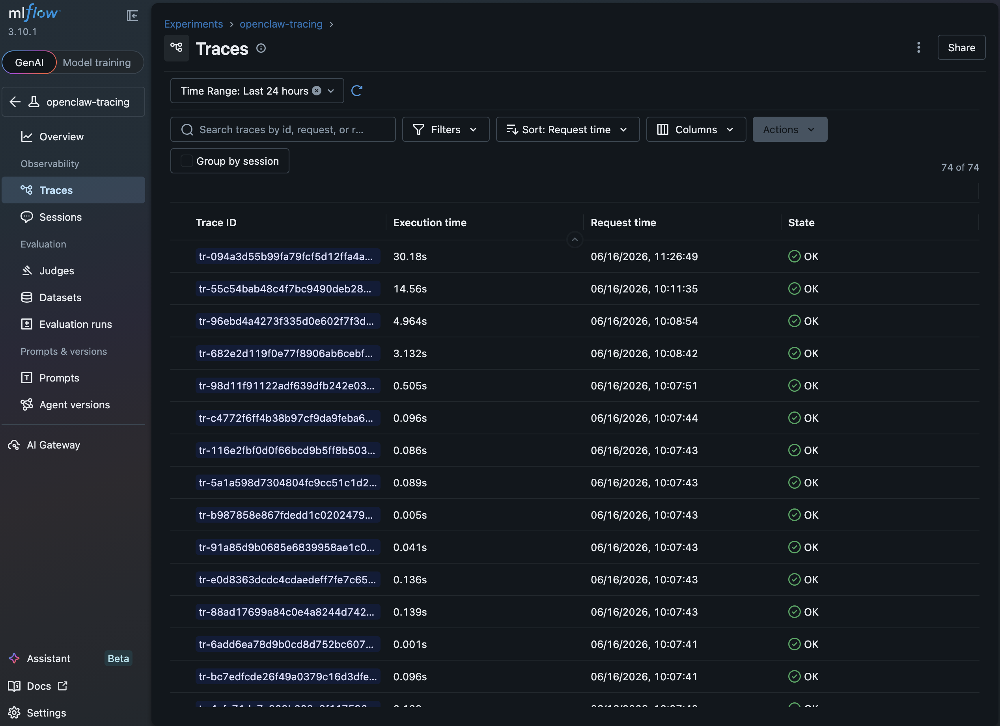
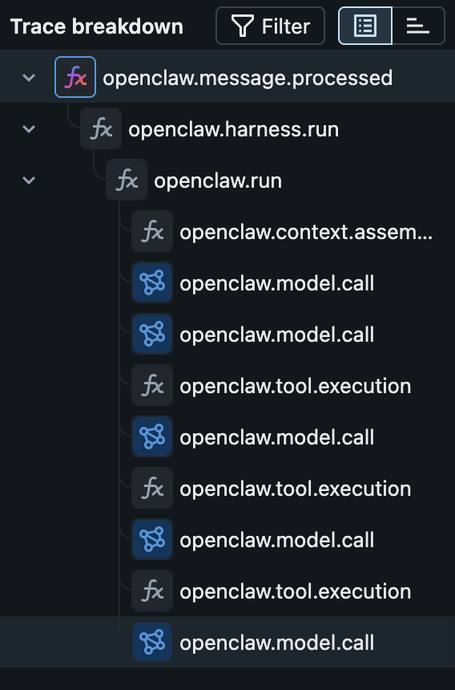
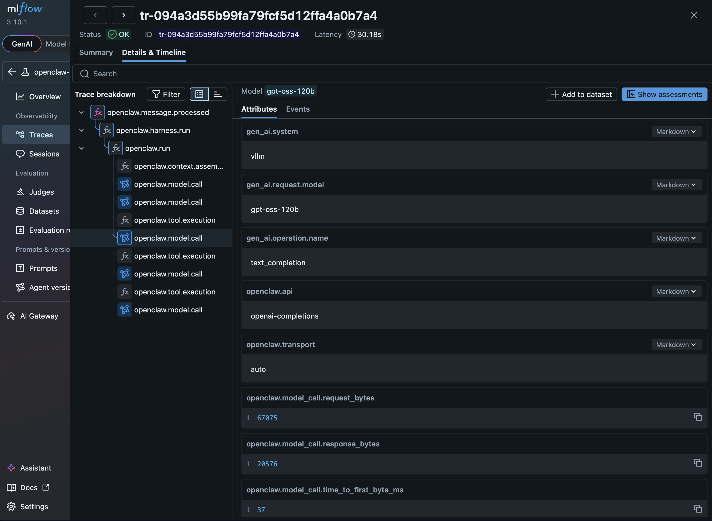
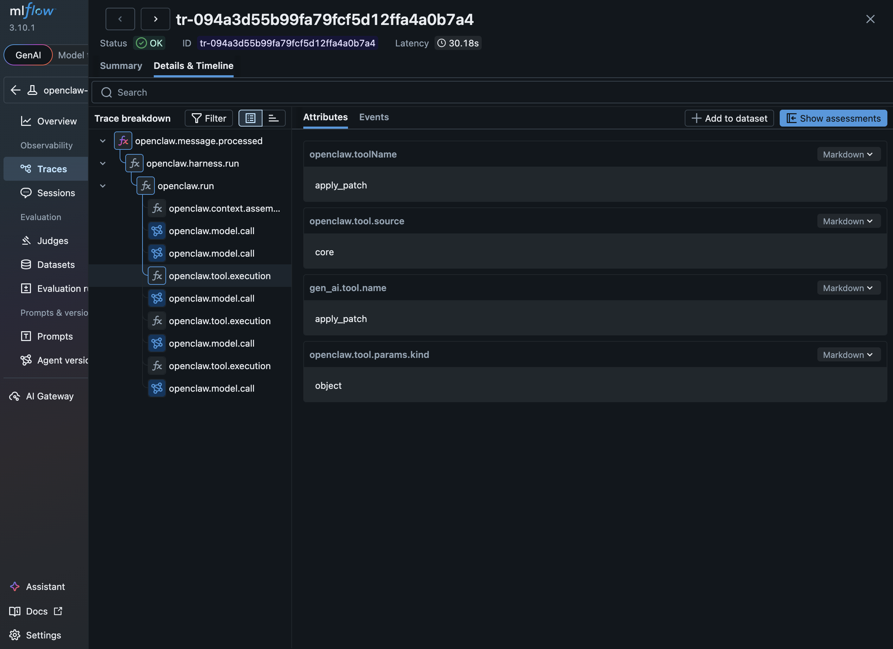

# MLflow Tracing for OpenClaw

> Tested: 2026-06-17 on OpenShift 4.19 (ROSA) with `ghcr.io/openclaw/openclaw@sha256:037f49ba1595be9502fb345138d727cd0cfaecf1392cbe0cfe053fb4681386cd`, vLLM `gpt-oss-120b`, RHOAI MLflow 3.x

OpenClaw natively emits OpenTelemetry (OTLP) traces via its `diagnostics-otel` plugin — no custom instrumentation, no Python hooks, no stop scripts. The [`overlays/mlflow-tracing/`](../overlays/mlflow-tracing/) Kustomize overlay in this repo deploys OpenClaw with an OTel collector sidecar that forwards spans to RHOAI's shared MLflow instance using standard OpenShift authentication and TLS. A multi-turn coding task with 8 model calls and 8 tool executions produced a 19-span trace with full tool names, latencies, request/response sizes, and context window stats — all visible in the MLflow UI.

For background on how RHOAI MLflow handles TLS and RBAC, see [MLflow on OpenShift: Authentication and TLS](../../../../docs/mlflow-openshift-auth-and-tls.md). This document covers the OpenClaw-specific OTel collector integration.

## Architecture

```text
┌─────────────────────────────────────────────────────────────┐
│  OpenClaw Pod (YOUR-NAMESPACE)                              │
│                                                             │
│  ┌──────────────┐    OTLP/HTTP     ┌────────────────────┐  │
│  │              │  localhost:4318   │                    │  │
│  │   OpenClaw   │ ───────────────► │   OTel Collector   │  │
│  │   Gateway    │                  │   (sidecar)        │  │
│  │              │                  │                    │  │
│  └──────────────┘                  └─────────┬──────────┘  │
│                                              │              │
└──────────────────────────────────────────────┼──────────────┘
                                               │ OTLP/HTTP + bearer auth
                                               │ TLS (Service CA)
                                               ▼
                              ┌──────────────────────────────┐
                              │  RHOAI MLflow                │
                              │  (redhat-ods-applications)   │
                              │  port 8443, TLS              │
                              └──────────────────────────────┘
```

The collector runs as a sidecar in the OpenClaw pod, receiving spans on localhost and forwarding to RHOAI's shared MLflow over the cluster network. Authentication uses the pod's ServiceAccount token as a bearer token — the same RBAC mechanism described in the [shared guide](../../../../docs/mlflow-openshift-auth-and-tls.md#rbac-setup).

### Component versions

| Component | Image |
|---|---|
| OpenClaw | `ghcr.io/openclaw/openclaw@sha256:037f49ba1595be9502fb345138d727cd0cfaecf1392cbe0cfe053fb4681386cd` |
| OTel Collector (0.120.0) | `ghcr.io/open-telemetry/opentelemetry-collector-releases/opentelemetry-collector-contrib@sha256:85ac41c2db88d0df9bd6145e608a3cb023f5d8443868adbfbbf66efb51087917` |
| MLflow | RHOAI-managed (3.x) |

### RBAC and TLS

The overlay's [`rbac.yaml`](../overlays/mlflow-tracing/rbac.yaml) creates:

- A dedicated `openclaw-tracing` **ServiceAccount** for the OpenClaw pod
- A **RoleBinding** to the operator-provided `mlflow-integration` ClusterRole (see [RBAC Setup](../../../../docs/mlflow-openshift-auth-and-tls.md#rbac-setup) for details)

The OTel collector reads the SA token from `/var/run/secrets/kubernetes.io/serviceaccount/token` via its `bearertokenauth` extension and sends it as a bearer token with every request.

For TLS, it uses the service CA certificate at `/var/run/secrets/kubernetes.io/serviceaccount/service-ca.crt`, which OpenShift auto-mounts into every pod. This is the same auth and TLS that the MLflow Python SDK handles via `MLFLOW_TRACKING_AUTH` and `MLFLOW_TRACKING_SERVER_CERT_PATH` — but since the OTel collector is not an MLflow SDK client, it's configured directly in the collector's [`config.yaml`](../overlays/mlflow-tracing/otel-collector-config.yaml).

---

## Trace Schema

### Span types

| Span name | What it captures | Key attributes |
|---|---|---|
| `openclaw.message.processed` | Turn-level root span | `channel`, `outcome`, `source` |
| `openclaw.harness.run` | Harness coordination | `items.started`, `items.completed`, `items.active` |
| `openclaw.run` | Agent run lifecycle | `provider`, `model`, `channel`, `trigger`, `outcome` |
| `openclaw.context.assembled` | Context window stats | `token_budget`, `system_prompt_chars`, `message_count`, `history_text_chars` |
| `openclaw.model.call` | LLM inference (span type: LLM) | `time_to_first_byte_ms`, `request_bytes`, `response_bytes`, `gen_ai.request.model` |
| `openclaw.tool.execution` | Tool call | `gen_ai.tool.name`, `openclaw.toolName`, `openclaw.tool.source`, `openclaw.errorCategory` |
| `openclaw.diagnostic.phase` | Startup diagnostics | `phase`, `cpu_user_ms`, `cpu_system_ms` |

### Trace hierarchy

A multi-tool agent turn produces this span tree:

```text
openclaw.message.processed           (turn-level root, 14.6s)
└── openclaw.harness.run             (items.completed=13)
    └── openclaw.run                 (trigger=user, outcome=completed)
        ├── openclaw.context.assembled    (token_budget=32768, message_count=4)
        ├── openclaw.model.call           (1.9s, request=68KB, TTFB=49ms)
        ├── openclaw.tool.execution       (read, 4ms)
        ├── openclaw.model.call           (2.0s, request=70KB, TTFB=294ms)
        ├── openclaw.tool.execution       (apply_patch, error)
        ├── openclaw.model.call           (1.4s, request=71KB, TTFB=43ms)
        ├── openclaw.tool.execution       (apply_patch, error)
        ├── ...                           (retry loop)
        ├── openclaw.tool.execution       (apply_patch, 15ms, success)
        └── openclaw.model.call           (1.8s, request=75KB, TTFB=48ms)
```

### Prototype trace data

**Cluster:** ROSA `agentic-mcp` | **Namespace:** `opc-on-ocp` | **Model:** `vllm/gpt-oss-120b`

| Trace | Spans | Duration | Description |
|---|---|---|---|
| `tr-55c54bab...` | 19 | 14.6s | Multi-tool: 8 model calls + 1 read + 7 apply_patch (6 errors, 1 success) |
| `tr-96ebd4a4...` | 5 | 5.0s | Single model call (4.7s LLM, 67KB request, 2.4KB response) |
| `tr-682e2d11...` | 5 | 3.1s | New session: first turn (1.6s LLM, 67KB request, 548B response) |

The `openclaw.model.call` spans capture `time_to_first_byte_ms` (40–294ms), `request_bytes` (67–75KB), and `response_bytes` (548B–2.4KB). Tool execution spans include `gen_ai.tool.name` and `openclaw.errorCategory` on failures.

### MLflow UI

**Traces list** — 74 traces captured in the `openclaw-tracing` experiment:



**Span waterfall** — tree hierarchy for a multi-tool agent turn:



**Model call attributes** — `openclaw.model.call` span detail showing request/response sizes and TTFB:



**Tool execution attributes** — `openclaw.tool.execution` span detail showing tool name and source:



---

## Setup

### Prerequisites

- **RHOAI with MLflow** — the `mlflow` service must be running in `redhat-ods-applications` with `--enable-workspaces`
- **The `mlflow-integration` ClusterRole** — shipped by the MLflow operator. Run `oc get clusterroles | grep mlflow-integration` to find the exact name (it may be prefixed, e.g. `mlflow-operator-mlflow-integration`). See [RBAC Setup](../../../../docs/mlflow-openshift-auth-and-tls.md#rbac-setup).
- **OpenShift 4.17+** with namespace-scoped access (`oc login`)
- **A vLLM-compatible model endpoint** (see [model-compatibility.md](model-compatibility.md))

### Step 1: Copy and configure the overlay

```bash
cp -r overlays/mlflow-tracing overlays/my-tracing
```

Replace every `YOUR-*` placeholder across these files:

| File | What to change |
|---|---|
| `kustomization.yaml` | `YOUR-NAMESPACE` |
| `rbac.yaml` | `YOUR-MLFLOW-INTEGRATION-CLUSTERROLE` (the name from the prerequisite step above) |
| `configmap-patch.yaml` | `YOUR-MODEL-ID`, `YOUR-VLLM-OR-OGX-ENDPOINT` |
| `otel-collector-config.yaml` | `YOUR-NAMESPACE` and `YOUR-EXPERIMENT-ID` (set after Step 3) |

Also set `VLLM_API_KEY` and `OPENCLAW_GATEWAY_TOKEN` in `../manifests/01-secret.yaml` — both default to placeholder values.

See [raw-deployment.md](raw-deployment.md) for how to find your model ID.

### Step 2: Create namespace and RBAC

```bash
oc new-project YOUR-NAMESPACE   # or use existing namespace

oc apply -f overlays/my-tracing/rbac.yaml -n YOUR-NAMESPACE
```

This creates:

- **`openclaw-tracing` ServiceAccount** — used by the OpenClaw pod
- **RoleBinding** — binds the `mlflow-integration` ClusterRole to the ServiceAccount

### Step 3: Create an MLflow experiment

RHOAI MLflow uses workspaces — your namespace maps to a workspace. Create an experiment in your workspace:

```bash
MLFLOW_ROUTE=$(oc get route mlflow -n redhat-ods-applications -o jsonpath='{.spec.host}')
TOKEN=$(oc create token openclaw-tracing)

curl -s -X POST "https://${MLFLOW_ROUTE}/mlflow/api/2.0/mlflow/experiments/create" \
  -H "Authorization: Bearer ${TOKEN}" \
  -H "Content-Type: application/json" \
  -H "X-MLFLOW-WORKSPACE: YOUR-NAMESPACE" \
  -d '{"name": "openclaw-tracing"}' | python3 -m json.tool
```

Note the `experiment_id` from the response. If the experiment already exists, look it up:

```bash
curl -s "https://${MLFLOW_ROUTE}/mlflow/api/2.0/mlflow/experiments/get-by-name?experiment_name=openclaw-tracing" \
  -H "Authorization: Bearer ${TOKEN}" \
  -H "X-MLFLOW-WORKSPACE: YOUR-NAMESPACE" | python3 -m json.tool
```

Update `YOUR-EXPERIMENT-ID` in your overlay's `otel-collector-config.yaml`.

### Step 4: Deploy OpenClaw

```bash
oc apply -k overlays/my-tracing
```

Wait for the `openclaw` pod to reach `2/2 Running` (gateway + otel-collector sidecar).

### Step 5: Connect

Port-forward OpenClaw:

```bash
oc port-forward deploy/openclaw 18789:18789 &
```

- **OpenClaw Control UI:** <http://localhost:18789> — paste the gateway token from `01-secret.yaml` when prompted
- **MLflow UI:** Access via the RHOAI dashboard or `oc get route mlflow -n redhat-ods-applications -o jsonpath='{.spec.host}'`

Navigate to the `openclaw-tracing` experiment in your workspace to view traces.

> Port-forward is required for the Control UI. The OpenShift Route works for HTTP requests but WebSocket connections flap through HAProxy's reverse proxy.

---

## Known Issues

### Traces not appearing (experiment 404)

**Symptom:** The OTel collector logs `Exporting failed. Dropping data. ... HTTP Status Code 404` but no further detail.

**Root cause:** The experiment ID in `otel-collector-config.yaml` doesn't exist in the target workspace. MLflow returns a 404 with no body, and the collector only logs the status code.

**Fix:** Verify the experiment exists in your workspace. Use the `get-by-name` API from Step 3 to look up the correct ID. Each workspace has its own experiment ID sequence — an experiment that exists in one workspace may not exist in another.

### WebSocket connections flap through the Route

The OpenShift Route terminates TLS at HAProxy, which disrupts the persistent WebSocket connections used by the Control UI. Symptoms: repeated connect/disconnect cycles (code 1006), prompts never reach the gateway.

**Fix:** Use `oc port-forward` instead of the Route for the Control UI.

---

## Gaps

1. **No tool call parameters or results in spans.** `openclaw.tool.execution` captures tool name, source, and latency, but not the input parameters or return values. Tracing what a tool was asked to do and what it returned requires cross-referencing session trajectory files.

2. **No token usage in spans.** `openclaw.model.call` captures request/response byte sizes but not discrete token counts. `llm.usage.input_tokens` / `llm.usage.output_tokens` would align with [OTel Semantic Conventions for GenAI](https://opentelemetry.io/docs/specs/semconv/gen-ai/) and enable cost tracking.

3. **No session ID across traces.** Multi-turn conversations produce separate traces per turn with no shared identifier. Correlating turns into a conversation requires manual timestamp matching in the MLflow UI.

4. **TracerProvider breaks on in-process restart.** The `diagnostics-otel` plugin does not re-initialize its `TracerProvider` / `BatchSpanProcessor` when the gateway receives SIGUSR1. Runtime spans are silently lost until a full pod restart. This overlay avoids the issue by setting the API key via env var interpolation instead of `paste-api-key`, but any config mutation that triggers SIGUSR1 will still break tracing.

---

## References

| Resource | URL |
|---|---|
| MLflow on OpenShift: Auth and TLS | [docs/mlflow-openshift-auth-and-tls.md](../../../../docs/mlflow-openshift-auth-and-tls.md) |
| OpenClaw OTel Documentation | <https://docs.openclaw.ai/gateway/opentelemetry> |
| OpenClaw Deployment Guide | [raw-deployment.md](raw-deployment.md) |
| OTel Collector Contrib | <https://github.com/open-telemetry/opentelemetry-collector-contrib> |
| MLflow OTLP Tracing | <https://mlflow.org/docs/latest/tracing/index.html> |
| OpenShift Service CA Certificates | <https://docs.openshift.com/container-platform/4.17/security/certificates/service-serving-certificate.html> |
