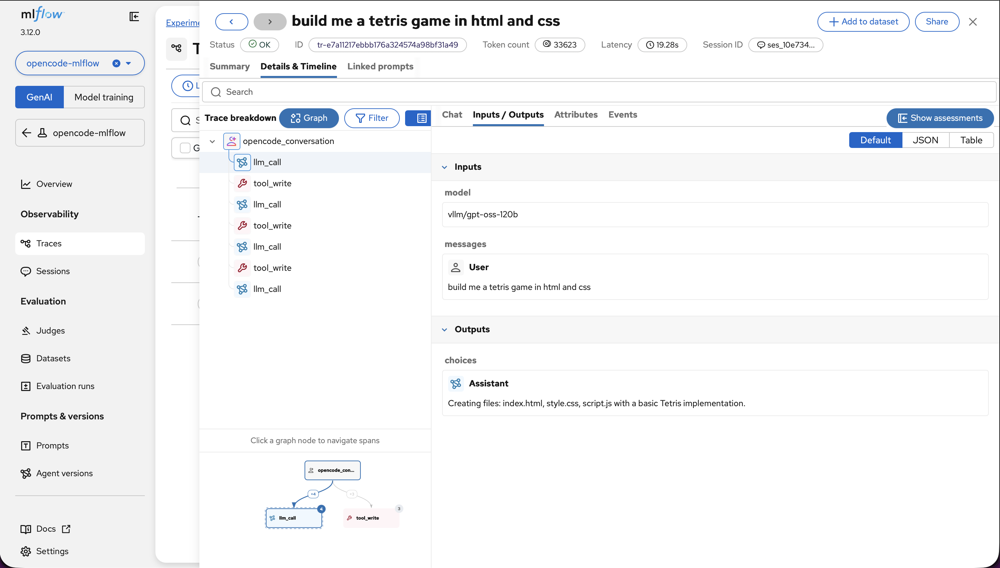
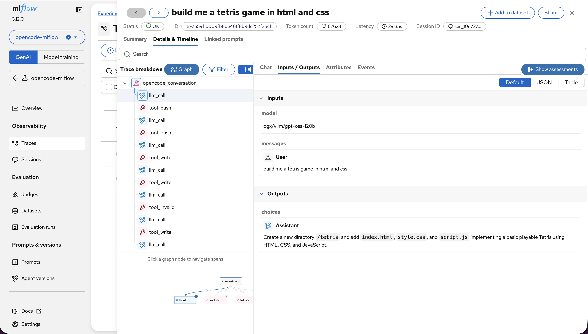

# MLflow Tracing for OpenCode on RHOAI

> **Setup instructions:** See [mlflow-tracing-setup.md](mlflow-tracing-setup.md).

MLflow tracing for OpenCode uses the `@mlflow/opencode` plugin, which hooks into OpenCode's `session.idle` events and exports traces to MLflow. It works in both web and CLI modes with zero impact on agent response times.

To validate the tracing stack, the prompt **"build me a tetris game in html and css"** was run through two backends: vLLM directly and OGX routing to vLLM. Both produced the same trace schema.

---

## Trace Schema

```text
opencode_conversation  (root)
+-- llm_call            -- LLM inference (model, messages, tokens)
+-- tool_write          -- file write (path, content)
+-- llm_call            -- next inference turn
+-- tool_bash           -- shell command (command, output)
+-- tool_write          -- another file write
+-- llm_call            -- final response
```

Each span captures: tool name, input parameters, output/result, and per-span latency.

| Field | Captured |
|---|---|
| Session ID | Yes |
| Total duration | Yes |
| Total tokens | Yes |
| Tool call sequence (waterfall) | Yes |
| Model | Yes |
| Status | Yes |

> **Privacy note:** Traces capture full prompt and response text, which may contain secrets, PII, or proprietary code. Treat the MLflow experiment store as sensitive data.

---

## Results: "Build me a Tetris game" across Both Backends

### vLLM direct (`gpt-oss-120b`)

| Metric | Value |
|---|---|
| Tokens | 33,623 |
| Latency | 19.28s |
| Spans | 8 |



---

### OGX to vLLM (`vllm/gpt-oss-120b`)

| Metric | Value |
|---|---|
| Tokens | 62,623 |
| Latency | 29.35s |
| Spans | 12 |



---

## Latency Comparison: vLLM Direct vs OGX to vLLM

The prompt **"What is the capital of France? One word only."** was run 5 times through each path. The first run was excluded as a cold start warmup.

| Path | Run 2 | Run 3 | Run 4 | Run 5 | Avg (runs 2 to 5) |
|---|---|---|---|---|---|
| **vLLM direct** | 0.363s | 0.352s | 0.347s | 0.361s | **0.356s** |
| **OGX to vLLM** | 0.189s | 0.428s | 0.389s | 0.365s | **0.343s** |

No measurable latency difference. OGX acts as a thin passthrough with no transformation overhead.
