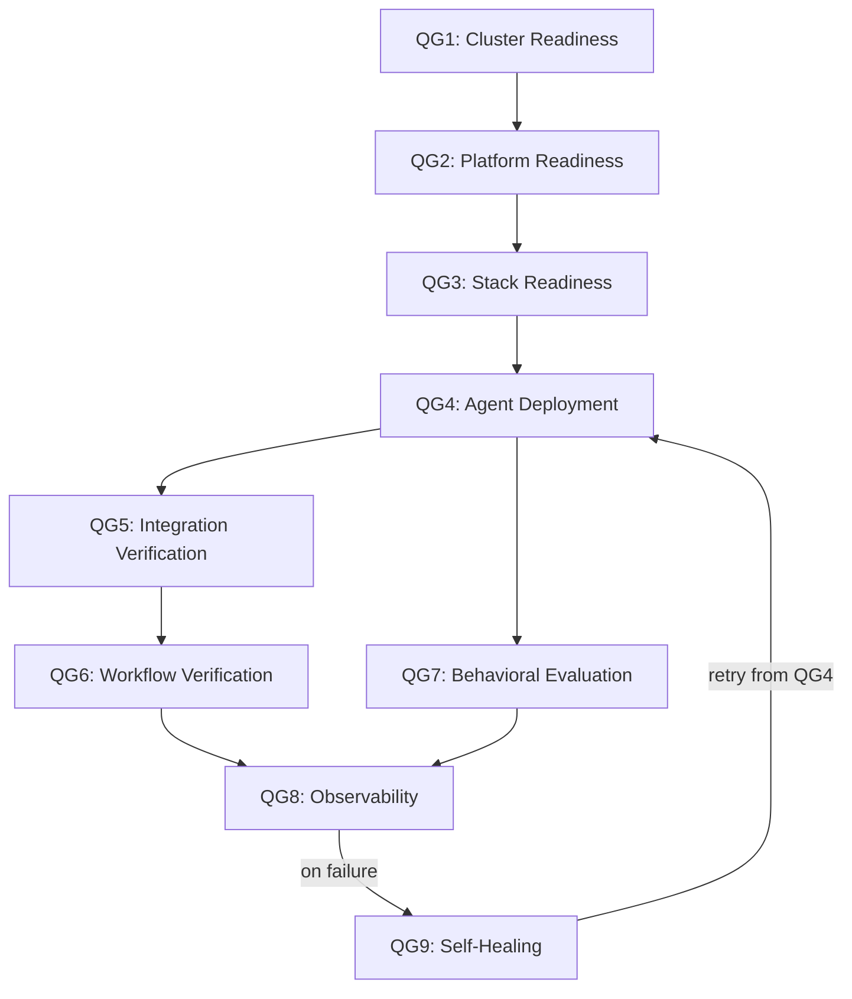

# CI Alert Policy

This document is the policy source of truth for MVP CI alerts in
`agentic-starter-kits`. It defines the routing, ownership, severity, and
SLA-path conventions for shared-branch CI alerts in this repository.

## Related tracking

- `RHAIENG-5827`: layered Quality Gates initiative
- `RHAIENG-5936`: CI alert policy definition
- `RHAIENG-5938`: CI alert runbook follow-on

## Scope

This policy applies to the current shared-branch CI alert sources in this
repository:

- `Code Quality`
- `Agent Tests`
- `Inner Loop Gating`
- `QG4: Agent Deployment Integration Tests`

The current implementation sends alerts only for shared-branch failures:

- `push` on `main`
- `schedule`, where supported by the workflow
- `workflow_dispatch` when the selected ref is `main`

This MVP does not send team Slack alerts for:

- `pull_request` runs
- `workflow_dispatch` runs on non-`main` branches
- successful workflow runs

## MVP Policy Summary

- **Route:** one shared CI alert destination, backed by the repository
  `SLACK_WEBHOOK_URL` secret.
- **Accountable owner group:** `@aaet-tooling-experience` (interim).
- **Human handling model:** notify-only. Alerts are visible and actionable, but
  this MVP does not define an acknowledgement SLA, resolution SLA, or after-hours
  on-call expectation.
- **System delivery expectation:** qualifying alerts should land in Slack within
  5 minutes of workflow failure.
- **Severity model:** canonical severity fingerprinting is based on the Quality
  Gate ladder, with lower-numbered QGs treated as higher priority.
- **Current implementation note:** not every current alert source is a canonical
  QG signal. `Code Quality` and `Agent Tests` remain non-canonical supporting
  signals for now.

## Canonical QG Severity Model

The canonical severity fingerprint follows the layered Quality Gate model for
this repository.

- `QG1` is the highest-priority fingerprint.
- Priority decreases as the workflow progresses upward through the stack.
- `QG9` is a remediation/retry stage, not a higher-priority signal than the
  earlier gate that produced the failure.

Only `QG4` and `QG7` emit alerts today. The remaining fingerprints are defined
here for future use as more of the QG ladder becomes alert-backed.

### Canonical ladder

| Fingerprint | Gate family | Relative priority |
| --- | --- | --- |
| `QG1` | Cluster readiness | Highest |
| `QG2` | Platform readiness | Higher |
| `QG3` | Stack readiness | High |
| `QG4` | Agent deployment | Elevated |
| `QG5` | Integration verification | Medium-high |
| `QG6` | Workflow verification | Medium |
| `QG7` | Behavioral evaluation | Medium-low |
| `QG8` | Observability | Low |
| `QG9` | Self-healing / retry loop | Lowest |

## Current implementation mapping

The repository does not yet emit alerts for the full QG ladder. The table below
maps the current workflow alerts to the canonical model where possible and
marks the remaining signals as non-canonical supporting alerts.

| Current signal | Workflow file | Canonicality | Severity fingerprint | Alert events | Route / owner |
| --- | --- | --- | --- | --- | --- |
| `Code Quality` | `code-quality.yml` | Non-canonical supporting signal | None yet | `push` on `main`, `workflow_dispatch` on `main` | Shared CI route / `@aaet-tooling-experience` |
| `Agent Tests` | `agent-tests.yml` | Non-canonical supporting signal | None yet | `push` on `main`, `workflow_dispatch` on `main` | Shared CI route / `@aaet-tooling-experience` |
| `Inner Loop Gating` | `eval-gating.yml` | Canonical | `QG7` | `push` on `main` when matching behavioral/eval paths change, `workflow_dispatch` on `main` | Shared CI route / `@aaet-tooling-experience` |
| `QG4: Agent Deployment Integration Tests` | `agent-deployment-test.yaml` | Canonical | `QG4` | `schedule`, `workflow_dispatch` on `main` | Shared CI route / `@aaet-tooling-experience` |

### Interpretation rules

- `QG4` alerts outrank `QG7` alerts because lower-numbered QGs carry higher
  priority.
- `Code Quality` and `Agent Tests` are still operationally important, but they
  do not carry canonical QG fingerprints yet.
- Supporting signals follow the same route and ownership path as canonical
  signals until the team assigns them a canonical QG mapping or separate
  fingerprinting scheme.

## Routing and ownership

### Route

The MVP uses a single Slack delivery path, configured through the repository
secret `SLACK_WEBHOOK_URL`.

This means:

- all qualifying alerts land in one shared destination
- there is no per-workflow channel routing yet
- there is no severity-based route split yet

### Accountable owner

The interim accountable owner group for all current CI alerts is
`@aaet-tooling-experience`.

This owner group is responsible for:

- watching the shared CI alert destination
- deciding whether a failure is a known issue, transient issue, or a new defect
- driving follow-up work or handoff when a failing workflow needs remediation

## SLA path

This MVP defines a system delivery path, not a human response SLA.

### System path

1. A qualifying shared-branch workflow run fails.
2. The repository posts one alert into the shared CI Slack destination.
3. The alert should arrive within 5 minutes of the qualifying failure.
4. The responder follows the workflow run link first, then uses the CI health
   dashboard for broader context.
5. Detailed triage steps live in the CI alert runbook that builds on this
   policy.

### Human expectation

- Alerts are `notify-only` for now.
- No acknowledgement target is defined in this MVP.
- No resolution target is defined in this MVP.
- No after-hours or on-call expectation is defined in this MVP.

## Non-goals for this MVP

This policy does not define:

- a multi-channel routing policy
- a PagerDuty or on-call escalation policy
- per-workflow Slack destinations
- retroactive renaming of current workflows to force canonical QG labels
- a canonical QG fingerprint for `Code Quality` or `Agent Tests`
